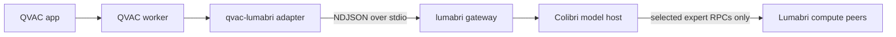

# qvac-lumabri

**QVAC-to-Lumabri adapter for distributed MoE expert execution over RPC.**

[](https://github.com/dyKiU/qvac-lumabri/actions/workflows/ci.yml)
[](https://github.com/dyKiU/qvac-lumabri/actions/workflows/upstream.yml)

## Purpose

- QVAC keeps the app, model lifecycle, streaming API, and provider transport.
- Lumabri distributes only the routed MoE experts.
- Attention, routing, KV cache, and dense layers remain on the QVAC host.



## Quick start

Build Lumabri with the gateway patch and matching Colibri sources:

```sh
git clone https://github.com/JustVugg/lumabri.git .upstream/lumabri
git clone https://github.com/JustVugg/colibri.git .upstream/colibri
git -C .upstream/lumabri checkout d493fb26d370ea9246a11b6b987b13d1bb84133d
git -C .upstream/colibri checkout b085b48888a88d9a1c00b151a9979774b72cdbfd
scripts/apply-lumabri-gateway.sh .upstream/lumabri
make -C .upstream/lumabri lumabri colibri_p2p expert_node_glm ENGINE=../colibri/c
```

Install and bundle the QVAC worker:

```sh
npm install
npm run bundle
npm run verify:bundle
```

Load the adapter as model type `lumabri-moe`:

```js
const modelId = await loadModel({
  modelSrc: '',
  modelType: 'lumabri-moe',
  modelConfig: {
    gatewayPath: process.env.LUMABRI_GATEWAY,
    localDir: process.env.LUMABRI_MODEL,
    enginePath: process.env.LUMABRI_ENGINE
  }
})
```

Use `model` plus `tracker` instead of `localDir` for a Lumabri swarm model.

## Compatibility

| Surface | Supported / pinned |
|---|---|
| Node.js | `>=20 <23` |
| QVAC SDK | `>=0.17.1 <0.18.0`; tested `0.17.1` |
| QVAC CLI | tested `0.11.0` |
| Zod | `>=4.4.3 <5.0.0`; tested `4.4.3` |
| Gateway protocol | `v1` NDJSON + base64 chunks |
| Lumabri / Colibri | exact refs in [`compatibility.json`](compatibility.json) |

The adapter streams text and stats, serializes same-model requests, resets KV
state between requests, supervises the native process, and supports hard
cancellation. Tools, attachments, structured output, and per-request sampling
are not supported in `0.1.x`.

## Verify

```sh
npm run check          # source, constraints, unit tests
npm run pack:check     # publish surface
npm run bundle         # real QVAC Bare worker
npm run test:qvac      # QVAC -> adapter -> fake gateway
```

CI also builds both Lumabri MoE sides against pinned Colibri sources. A weekly
canary repeats the build against all three upstream `main` branches.

Apache-2.0.
