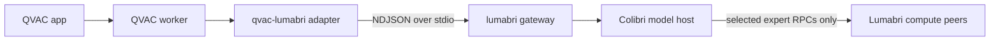

# qvac-lumabri

**QVAC-to-Lumabri adapter for distributed MoE expert execution over RPC.**

The adapter is authored in strict TypeScript and published as ESM JavaScript
with generated type declarations. Runtime configuration and protocol inputs
remain validated at the process boundary.

[](https://github.com/dyKiU/qvac-lumabri/actions/workflows/ci.yml)
[](https://github.com/dyKiU/qvac-lumabri/actions/workflows/upstream.yml)

## Purpose

- QVAC keeps the app, model lifecycle, streaming API, and provider transport.
- Lumabri distributes only the routed MoE experts.
- Attention, routing, KV cache, and dense layers remain on the QVAC host.


```mermaid
flowchart LR
  A[QVAC app] --> B[QVAC worker]
  B --> C[qvac-lumabri adapter]
  C -->|NDJSON over stdio| D[lumabri gateway]
  D --> E[Colibri model host]
  E -->|selected expert RPCs only| F[Lumabri compute peers]
```

## npm package vs git clone

`npm install @lumabri/qvac-adapter` installs the **plugin and TypeScript
surface only** (`dist/`, `contracts.json`, docs). **`native/*.patch` is not
published** — building `lumabri gateway` requires a **git checkout** of this
repository and the steps in [Native Lumabri build](docs/native-build.md).

## Quick start

Clone this adapter repository (not npm alone), then build native Lumabri/Colibri
for your contract line (primary supported pins shown; see [`contracts.json`](contracts.json)):

```sh
git clone https://github.com/dyKiU/qvac-lumabri.git
cd qvac-lumabri
git clone https://github.com/JustVugg/lumabri.git .upstream/lumabri
git clone https://github.com/JustVugg/colibri.git .upstream/colibri
git -C .upstream/lumabri checkout d493fb26d370ea9246a11b6b987b13d1bb84133d
git -C .upstream/colibri checkout 259858f95e49ccd10fd1e300f73894ce3fafe8e3
scripts/apply-lumabri-gateway.sh .upstream/lumabri native/lumabri-gateway.patch
make -C .upstream/lumabri lumabri colibri_p2p expert_node_glm ENGINE=../colibri/c
```

Install adapter dependencies and bundle the QVAC worker:

```sh
npm install
npm run bundle
npm run verify:bundle
```

Load the adapter as model type `lumabri-moe`:

```js
const modelId = await loadModel({
  modelSrc: '',
  modelType: 'lumabri-moe',
  modelConfig: {
    gatewayPath: process.env.LUMABRI_GATEWAY,
    localDir: process.env.LUMABRI_MODEL,
    enginePath: process.env.LUMABRI_ENGINE
  }
})
```

Use `model` plus `tracker` instead of `localDir` for a Lumabri swarm model.

## Compatibility

<!-- contracts:start -->
| Line | Status | Adapter | QVAC SDK / CLI | Gateway | Lumabri | Colibri |
|---|---|---|---|---|---|---|
| stable-0.1 | supported | 0.1.x | 0.17.1 / 0.11.0 | v1 | `post-v0.8.0 @ d493fb2` | `v1.4.0 @ b085b48` |
| stable-0.1-r2 | supported | 0.1.x | 0.18.1 / 0.12.0 | v1 | `post-v0.8.0 @ d493fb2` | `v1.7.0 @ 259858f` |
| dev-next | candidate | main | 0.21.0 / 0.15.0 | v1 | `post-v0.8.0 @ 941a2d0` | `v2.0.0 @ bf24429` |
| upstream-head | edge | main | main / main | v1 | `main` | `main` |
<!-- contracts:end -->

[`contracts.json`](contracts.json) is the source of truth. Supported contracts
gate releases; pinned candidates and upstream heads run as weekly canaries.
Node.js is `>=20 <23`; Zod is `>=4.4.3 <5.0.0`.

See [QVAC contract lines](docs/qvac-contract-lines.md) for **supported vs
candidate** behavior. In short: **`peerDependencies` match supported SDKs only**
(`0.17.1 || 0.18.1`). The **`dev-next`** row (for example QVAC `0.21.x`) is
validated in **Upstream compatibility** CI with packed SDK builds — installing
`@qvac/sdk@latest` from npm does **not** by itself mean you are on the candidate
line.

## Capabilities in adapter 0.1.x

This release is a **text streaming** bridge to the Lumabri gateway, not a full
QVAC feature surface. Supported behavior:

- Text completions (streamed or buffered), stats from the gateway, per-model
  request queue, KV reset between requests, local or SSH gateway transport.

**Not supported** (requests fail with explicit errors from the plugin):

- Tool calling (`tools` on completion requests)
- Message attachments
- Non-text `responseFormat` (only `{ type: 'text' }` is accepted)
- Per-request sampling overrides beyond what the gateway/engine expose
- **`cancelLumabri()` / `lumabriStatus()` on delegated loads** — supported QVAC
  SDKs do not delegate custom plugin RPC; those helpers work for **local**
  loads only (see `contracts.json` `delegatedPluginRpc` per line).

Do not assume other QVAC model features work because the model type is
`lumabri-moe`.

## Multi-node

`createQvacProviderPool()` checks an ordered set of compatible QVAC providers,
loads on the first healthy coordinator that succeeds, and records the selected
provider. That coordinator then uses Lumabri to RPC only its routed MoE experts.

See [multi-node QVAC and Lumabri](docs/multi-node.md) for configuration,
failure boundaries, and the physical-host acceptance test.

## Verify

```sh
npm run typecheck      # strict TypeScript contracts
npm run build          # emit ESM JavaScript and declarations to dist/
npm run check          # source, constraints, unit tests
npm run check:native-upstreams # detect Lumabri/Colibri head or release drift
npm run check:freshness # compare candidate pins with latest releases
npm run pack:check     # publish surface
npm run bundle         # real QVAC Bare worker
npm run test:qvac      # QVAC -> adapter -> fake gateway
```

CI also builds both Lumabri MoE sides against pinned Colibri sources. A daily
canary detects Lumabri and Colibri head or release drift, then qualifies both
the candidate pins and upstream `main` branches. QVAC source contracts run as
a separate canary matrix.

Apache-2.0.
