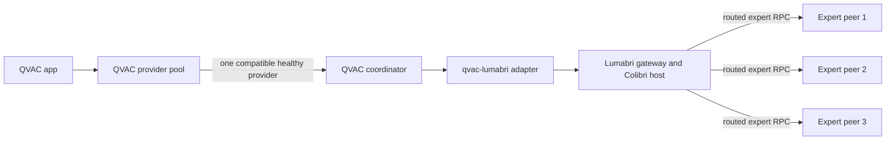

# Multi-node QVAC and Lumabri

QVAC and Lumabri distribute different parts of inference:

- QVAC selects one whole-model coordinator for a load and its completions.
- The model router selects the top-k experts for each MoE layer.
- Lumabri selects a live peer holding each routed expert.



The coordinator retains attention, router, dense weights and KV cache. Expert
weights stay on Lumabri peers once the swarm has complete expert coverage.

## Provider pool

QVAC SDK `0.17.1` delegates directly to one provider public key. It does not
discover equivalent model providers or choose between them. The adapter adds a
small client-side pool for that policy.

```js
import { createQvacProviderPool } from '@lumabri/qvac-adapter'

const pool = createQvacProviderPool({
  contractId: 'stable-0.1',
  modelFingerprint: process.env.MODEL_FINGERPRINT,
  providers: [
    {
      providerPublicKey: process.env.QVAC_PROVIDER_A,
      contractId: 'stable-0.1',
      modelFingerprint: process.env.MODEL_FINGERPRINT
    },
    {
      providerPublicKey: process.env.QVAC_PROVIDER_B,
      contractId: 'stable-0.1',
      modelFingerprint: process.env.MODEL_FINGERPRINT
    }
  ]
})

const { modelId, provider } = await pool.loadModel({
  modelSrc: '',
  modelType: 'lumabri-moe',
  modelConfig: {
    gatewayPath: process.env.LUMABRI_GATEWAY,
    model: 'production-model',
    tracker: process.env.LUMABRI_TRACKER,
    enginesDir: process.env.LUMABRI_ENGINES
  }
}, {
  timeout: 10 * 60 * 1000,
  healthCheckTimeout: 3000
})

console.log(`model ${modelId} is pinned to ${provider.providerPublicKey}`)
```

Provider order is priority order. Health checks run concurrently; model loading
tries healthy providers in that stable order until one succeeds. The pool always
sets `fallbackToLocal: false`, so an unavailable remote coordinator cannot be
mistaken for successful failover.

`contractId` identifies the exact supported row in [`contracts.json`](../contracts.json).
`modelFingerprint` should identify immutable checkpoint contents, not a mutable
path or display name. Provider records are operator configuration: QVAC heartbeat
proves reachability, but QVAC currently has no signed capability or load endpoint.

After unloading a model, remove the pool's observation record:

```js
pool.forgetModel(modelId)
```

QVAC itself retains the authoritative model-to-provider binding used for
completion RPC.

## Remote model host over SSH

A QVAC provider may keep the worker on one machine while running the Lumabri
gateway and Colibri engine on a private model host. Set `transport.type` to
`ssh`; `gatewayPath`, `localDir`, and the engine path then refer to the remote
host.

The SSH transport always uses batch mode, strict host-key checking, disabled
forwarding, and individually quoted remote arguments. Enrol the model host key
and credentials in the provider machine's private configuration; do not put
them in this repository.

The opt-in `npm run test:physical` check reads provider keys, host alias,
remote paths, and model fingerprint from environment variables. Use the
comma-separated `QVAC_PROVIDER_PUBLIC_KEYS` form to verify failover order. Its
JSON result contains hashes, selected provider index, and timings—but no keys,
hostnames, paths, prompts, or generated text.

## Lumabri expert swarm

Every QVAC provider runs its own gateway and Colibri coordinator, but all of
them may join the same Lumabri tracker and expert swarm.

An expert donor joins with the engine-specific node:

```sh
expert_node_glm \
  --model /srv/models/production-model \
  --model-name production-model \
  --tracker tracker.example:7300 \
  --hold 64 \
  --cache 16
```

The tracker assigns uncovered experts first. The origin server also executes
the full expert set, providing initial coverage and a replica when donors join.
For each routed `(layer, expert)` pair, the coordinator prefers its nearest live
replica and retries the next replica after failure.

Remote expert mode starts only when every routed expert has coverage. Before
that point the coordinator executes experts locally. After remote mode starts,
exhausting every replica for a selected expert is a hard generation error.

## Failure boundaries

| Failure | Recovery |
|---|---|
| Provider is offline before load | Pool tries the next healthy provider |
| Provider rejects model load | Pool tries the next healthy provider |
| Expert peer fails | Lumabri retries another replica |
| Provider fails between completions | Load the model on another provider and replay full history |
| Provider fails during streaming | Restart generation elsewhere; transparent continuation is not supported |
| Every replica of a routed expert fails | Generation stops with an error |

KV cache is coordinator-local. Transparent mid-stream migration would require a
separate replicated-state protocol and is outside this adapter.

## Physical-host acceptance test

Use at least two QVAC coordinators and three expert machines:

1. Start one Lumabri tracker/origin for the immutable model.
2. Start expert donors with enough replicated coverage to survive one donor loss.
3. Start QVAC providers A and B with the same adapter contract and model identity.
4. Give the client both public keys and load through `QvacProviderPool`.
5. Generate a fixed prompt and compare its tokens with a local Colibri baseline.
6. Stop provider A before a new load; verify the pool selects B.
7. Stop one expert donor during generation; verify a replica takes over.
8. Require identical output tokens and Lumabri logs showing remote expert calls.

The repository's unit tests prove selection and load failover. QVAC's adapter
test proves the QVAC-to-gateway stream, while Lumabri's phase-two tests compare
local and RPC expert execution token-for-token. The physical-host test above is
the release gate for claiming the combined network survives real machine loss.
